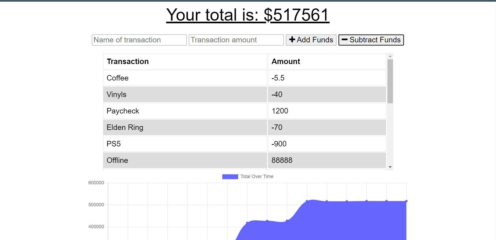

# Track Your Cash
## Description
  
- Reason behind the project: To be able to develop a budget tracking application that can work offline if there is connectivity problems.
- Purpose or Problem Solved: Helps users to be able to upload their expenses once connectivity is back to the app.
- Important information learned: Learned how to install service-workers
  
## Table of Contents (Optional)
  
- [Installation](#installation)
- [Usage](#usage)
- [Credits](#credits)
- [License](#license)
- [Tests](#tests)
- [Questions](#questions)
  
## Installation

Follow the link below, and download the app to your mobile or desktop
https://obscure-atoll-25805.herokuapp.com/
## Usage
  
Enter expenses or deopists and watch your graph change

Screenshot attatched
  

  
## Credits
  
Collaborators: None 
  
## License
  
Unlicensed

## Tests
  
No tests
  
## Questions
  
All questions and communications can be directed to:
Github: github.com/frivera14 
